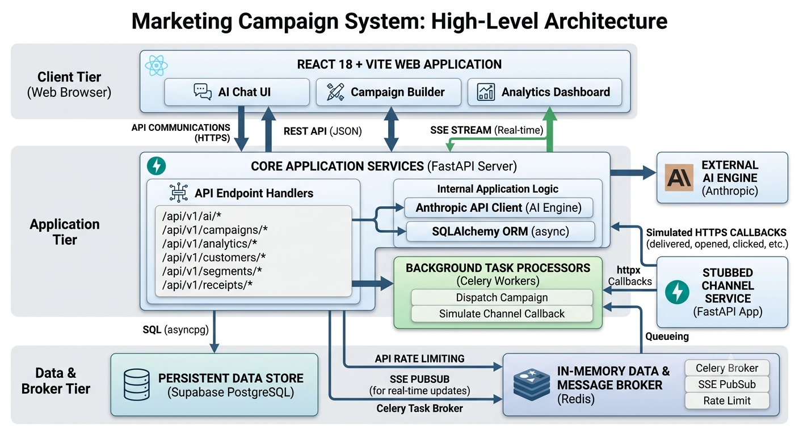

# AI-Native Mini CRM

**Live Demo URL**: YOUR_VERCEL_URL  
**Demo Credentials**: demo@aurabeauty.com / demo1234  
**Walkthrough Video**: YOUR_LOOM_URL  

An AI-Native Mini CRM built for consumer brands to intelligently segment their audience and dispatch customized messaging campaigns. The CRM features an integrated AI chat interface that directly generates dynamic audience segments, drafts message copy, and monitors real-time funnel analytics.

---

## Architecture



### Services

| Service | Port | Tech | Purpose |
|---|---|---|---|
| `crm-api` | 8000 | FastAPI + Uvicorn | Main CRM backend for API requests, routing, and SSE streams. |
| `crm-worker` | — | Celery | Background async processing for campaign dispatches. |
| `channel-stub` | 8001 | FastAPI + Uvicorn | Simulates external vendor platforms for message callbacks. |
| `crm-frontend` | 3000 | Vite + React | Frontend React SPA. |
| `postgres` | 5432 | Supabase | Managed persistent relational database for all models. |
| `redis` | 6379 | Redis | Celery broker, Pub/Sub channel for SSE analytics. |

---

## Key Technical Decisions

**1. SQLAlchemy Async**
- **What**: Replaced synchronous SQLAlchemy queries with `asyncpg` bindings.
- **Why**: Drastically improves performance for I/O bound endpoints like SSE tracking, preventing worker pool starvation during long-polling requests.
- **Tradeoff**: Increases query complexity and debugging difficulty.

**2. Celery for Dispatch**
- **What**: Offloaded the `dispatch_campaign` endpoint loop to distributed Celery workers.
- **Why**: Dispatches shouldn't block HTTP processes. Celery inherently supports task retries on connection failures, critical for mass messaging.
- **Tradeoff**: Introduces a new infrastructure dependency (Redis broker) and complex worker state management.

**3. SSE over WebSockets**
- **What**: Utilized Server-Sent Events (SSE) instead of WebSockets for live analytics.
- **Why**: SSE allows a simple unidirectional data flow which is much lighter for funnel stat updates.
- **Tradeoff**: Bi-directional communication is not possible, meaning the frontend cannot talk back without doing traditional REST calls.

**4. JSONB Rule Tree for Segments**
- **What**: Segment configuration (`filter_rules`) is stored dynamically as recursive JSONB nodes.
- **Why**: Allows infinite nesting (e.g. `AND(OR(eq, gt), lt)`) without managing complicated multi-join relational schemas for individual rules.
- **Tradeoff**: Complex to query against when creating analytics, requiring application-layer compilation (`filter_compiler.py`) to build dynamic SQLAlchemy bounds.

**5. Idempotency Design**
- **What**: Used Postgres `INSERT ON CONFLICT DO NOTHING` for communication receipt logs.
- **Why**: Because the simulated Channel Stub operates asynchronously, network retries inevitably cause duplicated webhooks. This setup guarantees safety.
- **Tradeoff**: Re-processing duplicate events consumes database compute slightly but requires less application code.

**6. Direct Anthropic SDK**
- **What**: Called the Anthropic Claude API directly rather than using a layer like LangChain.
- **Why**: Prevents bloated abstraction layers, giving full control over prompt engineering, JSON schema injection, and retry limits.
- **Tradeoff**: Manual error handling is required, including the parsing of structured models out of raw string completion tokens.

---

## Scale Considerations

At 1M customers, I would:
- **Segment execution** → Route `SELECT` traffic entirely to a dedicated database read replica so segment previews don't degrade insertion throughput.
- **Campaign dispatch** → Structure Celery jobs into a canvas `chord` or `group` partitioned to execute max 500 concurrent sub-tasks per worker, preventing OOM crashes.
- **Analytics** → Run a materialized view refresh cron job instead of computing counts in real-time per each callback cache update.
- **Receipt endpoint** → Segregate the rate-limiting on a per-campaign/per-webhook-provider basis rather than just restricting global ingress IPs.
- **Redis pubsub** → Replace Redis Pub/Sub with Kafka to persist the analytics event stream so offline consumers can re-read it upon transient failures.

---

## AI-Native Workflow

This application was heavily developed utilizing agentic AI frameworks:
- Initial product architectures, `spec.md`, and `todo.md` roadmaps were directly generated using deep reasoning from AI models.
- Context windows were kept explicitly clean by utilizing isolated "Phase-by-phase" prompts.
- Complex parsing logic such as `filter_compiler.py` and recursive tree algorithms were designed in tandem with an AI copilot.
- The intent system in `ai/prompts.py` was constructed using auto-regressive analysis, simulating user inputs alongside AI prompt assistance.

---

## Local Setup

```bash
# 1. Clone the repository
git clone https://github.com/YOUR_USERNAME/xeno_project.git
cd xeno_project

# 2. Start PostgreSQL & Redis
# Ensure you have Postgres and Redis running locally, or configure your .env
# Copy the `.env.example` file and configure credentials.
cp backend/.env.example backend/.env

# 3. Setup Python Virtual Environment (Backend)
cd backend
python -m venv venv
# On Windows:
venv\Scripts\activate
# On macOS/Linux:
source venv/bin/activate

# 4. Install backend dependencies
pip install -r requirements.txt

# 5. Run Alembic Migrations & Seed Data
alembic upgrade head
python seed.py

# 6. Start the Backend API & Channel Stub Service
# (In separate terminals)
uvicorn app.main:app --host 0.0.0.0 --port 8000 --reload
uvicorn channel_stub.main:app --host 0.0.0.0 --port 8001 --reload

# 7. Start Celery Worker
celery -A celery_app worker --loglevel=info

# 8. Setup & Start Frontend
cd ../frontend
npm install
npm run dev
```
