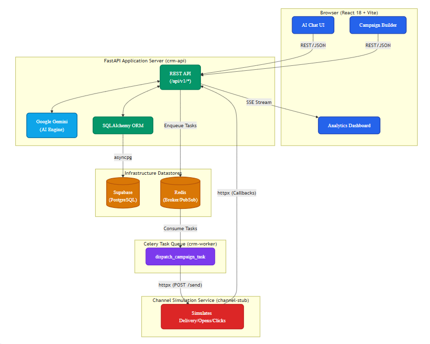

---

# AI-Native Mini CRM
### Built for Xeno Engineering Take-Home Assignment

> A production-grade CRM for consumer brands to intelligently reach 
> their shoppers — powered by AI-driven segmentation, async campaign 
> delivery, and real-time analytics.

---

## 🔗 Live Links

| | URL |
|---|---|
| **Frontend** | https://xi-native-crm.vercel.app |
| **Backend API** | https://xenoassessment-production-8dd8.up.railway.app |
| **API Docs** | https://xenoassessment-production-8dd8.up.railway.app/docs |
| **Channel Stub** | https://channel-stub-4x4x.onrender.com |
| **GitHub** | https://github.com/jainishjain11/xeno_assessment |

**Demo credentials:** `demo@aurabeauty.com` / `demo1234`

---

## 📹 Walkthrough Video

[YOUR LOOM VIDEO URL]

---

## 🧠 What I Built

A Mini CRM for **Aura Beauty** — a fictional Indian DTC beauty brand 
with 1,000+ shoppers. The product lets a marketer:

1. **Describe intent in natural language** — "Find high-spending customers 
   who haven't ordered in 30 days and draft a WhatsApp win-back message"
2. **AI segments the audience** — natural language compiles to dynamic 
   SQL via a JSONB rule tree
3. **Campaign dispatches asynchronously** — Celery workers push messages 
   to a stubbed channel service
4. **Channel stub simulates delivery** — fires callbacks back to the CRM 
   simulating sent → delivered → opened → clicked → converted
5. **Live analytics surface in real time** — SSE stream updates the 
   delivery funnel as callbacks arrive

---

## 🏗️ Architecture



```text
Browser (React 18 + Vite + Tailwind)
│
│ REST + SSE
▼
FastAPI (CRM API) ──────────── Gemini API
│                     (AI Engine)
├── SQLAlchemy ─────── Supabase PostgreSQL
│   (async ORM)       (hosted DB)
│
└── Celery ─────────── Upstash Redis
│                 (broker + SSE pubsub)
│
└── Channel Stub (FastAPI, Render)
│
└── Celery Worker
│
└── Fires callbacks
back to /receipts/callback
```

### Service Map

| Service | Tech | Hosted On | Purpose |
|---|---|---|---|
| `crm-api` | FastAPI + Uvicorn | Railway | Core CRM backend |
| `crm-worker` | Celery | Railway | Campaign dispatch tasks |
| `channel-stub` | FastAPI + Uvicorn | Render | Simulates message delivery |
| `channel-worker` | Celery | Render | Fires async delivery callbacks |
| `frontend` | React + Vite | Vercel | Marketer UI |
| `postgres` | PostgreSQL | Supabase | Primary database |
| `redis` | Redis | Upstash | Celery broker + SSE pubsub |

---

## ⚙️ Tech Stack

### Backend
| Concern | Choice | Why |
|---|---|---|
| Framework | FastAPI | Async native, automatic OpenAPI docs, best Python AI ecosystem fit |
| ORM | SQLAlchemy 2 async | Alembic migrations, expression API for dynamic filter compiler |
| Task Queue | Celery + Redis | Reliable async dispatch, retries, concurrency control |
| AI | Google Gemini 1.5 Flash | Fast, free tier, excellent instruction following for JSON output |
| Real-time | SSE via sse-starlette | Unidirectional stream fits analytics — simpler than WebSockets |
| Auth | JWT via python-jose | Stateless, scales horizontally, no session table needed |
| Rate Limiting | slowapi | Redis-backed, protects receipt endpoint from callback floods |

### Frontend
| Concern | Choice | Why |
|---|---|---|
| Framework | React 18 + Vite | Sub-second HMR, modern defaults |
| UI | shadcn/ui + Tailwind | Owned components, no vendor lock-in |
| State | Zustand + TanStack Query | Zustand for global state, React Query for server cache |
| Forms | React Hook Form + Zod | Performant, schema-validated, shared types with backend |
| Charts | Recharts | React-native SVG charts, composable |
| SSE Client | @microsoft/fetch-event-source | Handles reconnection, supports POST-based SSE |

---

## 🗄️ Database Schema

7 tables in Supabase PostgreSQL:
```text
customers ──────────── orders
│
└── segments (JSONB filter_rules)
│
campaigns
│
communication_logs ── receipt_events
│
(idempotency_key: campaign_id:customer_id)
```

### Key Design Decisions in the Schema

**`communication_logs.idempotency_key`** — a UNIQUE column with value 
`{campaign_id}:{customer_id}`. All dispatch inserts use 
`ON CONFLICT DO NOTHING`. This means the entire dispatch task 
is safe to retry — it will never create duplicate messages.

**`receipt_events` as append-only audit log** — every callback from 
the channel stub is written here regardless of whether it is a 
duplicate. This gives us a complete audit trail and makes 
idempotency provable.

**`segments.filter_rules` as JSONB rule tree** — segments are stored 
as a recursive operator/rules tree that the backend compiles to 
SQLAlchemy expressions at query time. This means the AI can 
generate any segment without requiring a schema migration.

**`campaign_funnel_stats` SQL view** — a pre-built view that 
aggregates delivery/open/click rates per campaign. The analytics 
endpoint queries this view and caches the result in Redis. 
The SSE stream publishes updates on every callback received.

---

## 🔄 Async Webhook Lifecycle

The two-service callback loop is the core system design challenge:

```text
CRM launches campaign
│
▼
dispatch_campaign_task (Celery)
│ creates communication_log rows
│ (ON CONFLICT DO NOTHING — idempotent)
│
▼
POST /send → Channel Stub
│ returns 202 immediately
│
▼
simulate_delivery_task (Celery, channel stub worker)
│
├── sleep 1-5s → POST "sent" callback
├── sleep 2-8s → POST "delivered" (85%) or "failed" (15%)
├── sleep 5-15s → POST "opened" (40% of delivered)
├── sleep 2-5s → POST "read" (70% of opened)
├── sleep 3-8s → POST "clicked" (20% of read)
└── sleep 1-3s → POST "converted" (10% of clicked)
│
▼
POST /receipts/callback → CRM Receipt API
│
├── Layer 1: Redis idempotency key check (24h TTL)
├── Layer 2: receipt_events dedup check
├── Layer 3: forward-only state transition
├── Layer 4: out-of-order backfill
│
└── Always returns 200 OK
│
▼
update_campaign_aggregate_task (Celery)
│ refreshes Redis cache
└── publishes to SSE pubsub channel
│
▼
Browser receives funnel_update SSE event
Live chart updates in real time
```

### Idempotency — The Four Layers

This is the most critical engineering decision in the system.
The receipt endpoint handles duplicate and out-of-order callbacks
without corrupting campaign metrics:

**Layer 1 — Redis pre-check**
`GET idempotency:receipt:{event_id}` — if exists, return "duplicate" 
immediately. O(1) lookup, no DB hit for duplicates.

**Layer 2 — DB event dedup**
Check `receipt_events` table for existing row with same 
`communication_log_id + event_type`. Handles cases where 
Redis TTL expired but event was already processed.

**Layer 3 — Forward-only state machine**
Status order: queued → sent → delivered → opened → read → clicked → converted
A callback can only advance the state, never go backwards.
`failed` is always accepted regardless of current state.

**Layer 4 — Out-of-order backfill**
If `clicked` arrives before `delivered`, all intermediate timestamps 
(delivered_at, opened_at, read_at) are set to NOW() so the funnel 
remains mathematically consistent.

---

## 🤖 AI Integration

### Intent Parsing Pipeline
```text
Marketer types: "Find VIP customers who haven't ordered in 60 days,
draft a WhatsApp win-back with 15% discount"
│
▼
POST /ai/parse-intent
│
▼
Gemini 1.5 Flash
System prompt includes:
Full schema of filterable fields + operators
Brand context (Aura Beauty, Indian market)
Required JSON output format
│
▼
Returns structured JSON:
{
"segment_rules": { "operator": "AND", "rules": [...] },
"segment_name": "Lapsed VIP 60d",
"message_draft": "Hey {{first_name}}! ...",
"recommended_channel": "whatsapp",
"reasoning": "..."
}
│
▼
Pydantic validates output
If invalid JSON → retry once with error context
│
▼
Frontend pre-populates segment builder + message composer
Marketer reviews, edits, approves → launches campaign
```

### Segment Filter Compiler

The most technically interesting piece of backend code.
`backend/app/utils/filter_compiler.py` takes the AI-generated 
JSONB rule tree and compiles it to SQLAlchemy expressions:

```python
# Input from AI:
{
  "operator": "AND",
  "rules": [
    {"field": "total_spent", "op": "gte", "value": 5000},
    {"field": "last_order_at", "op": "lt", 
     "value": "NOW() - INTERVAL '60 days'"}
  ]
}

# Compiles to SQLAlchemy:
WHERE customers.total_spent >= 5000
AND customers.last_order_at < NOW() - INTERVAL '60 days'
```

Supports: AND/OR nesting, 11 operators, date-relative values,
PostgreSQL array operators for tags, order-level joins.

---

## 📐 Key Technical Decisions & Tradeoffs

| Decision | Chosen | Alternative | Reason |
|---|---|---|---|
| Segment rules | JSONB rule tree → dynamic SQL | Hardcoded filter forms | AI can generate any segment without schema migration |
| ORM | SQLAlchemy 2 async | Tortoise ORM | Expression API needed for filter compiler, Alembic for migrations |
| Real-time | SSE | WebSockets | Analytics is unidirectional server→client, SSE is simpler and proxy-friendly |
| AI | Gemini direct SDK | LangChain | Avoided abstraction overhead, full control over prompt + retry logic |
| Auth | Stateless JWT | Session + DB table | Scales horizontally, no shared session state between workers |
| Receipt idempotency | 4-layer (Redis + DB + state machine + backfill) | Simple dedup | Bulletproof under retry storms and out-of-order delivery |
| Channel simulation | Separate FastAPI service | Same-process mock | Reflects real architecture, tests the actual async callback loop |
| Celery tasks | Synchronous SQLAlchemy engine | Async in tasks | Celery workers are sync processes, async SQLAlchemy doesn't work inside them |

---

## 📈 Scale Considerations

This system is designed for a demo at ~1,000 customers. 
At production scale I would make these changes:

**At 100,000 customers:**
- Segment query execution → dedicated PostgreSQL read replica
- Campaign dispatch → Celery canvas chord/group (500 concurrent)
- Replace per-callback cache invalidation → materialized view 
  refresh job on a 30-second schedule

**At 1,000,000 customers:**
- Segment preview → async job (too slow for synchronous HTTP)
- Redis pubsub → Apache Kafka for analytics stream
- Receipt endpoint → per-campaign rate limiting not per-IP
- communication_logs → partition by campaign_id
- Add a dedicated time-series DB (TimescaleDB) for funnel analytics

**What I consciously chose NOT to build:**
- Pagination cursor-based (offset is fine at this scale)
- Message queue for receipt callbacks (Redis is sufficient)
- Multi-tenancy (single brand scope kept things clean)
- A/B testing (out of scope for the assignment)

---

## 🧪 Testing

A complete test suite is defined in `test.md` covering 50 test cases
across all 10 system areas. The most critical tests are:

**T33 — Duplicate idempotency:** Same event_id sent twice → 
second call returns `{"status":"duplicate"}`, DB unchanged.

**T34 — Out-of-order backfill:** `clicked` callback arrives before 
`delivered` → all intermediate timestamps backfilled, funnel intact.

**T36 — Malformed payload:** Garbage JSON to receipt endpoint → 
always returns 200 OK, never errors to channel stub.

---

## 🤖 Development Workflow

This project was built using a structured development workflow:

1. **spec.md first** — full architecture, schema, API contracts, 
   and webhook lifecycle designed before any code was written

2. **todo.md as execution plan** — 15 phases, each broken into 
   micro-tasks. Checked off as completed.

3. **Phase-by-phase execution** — each phase 
   opened with the same context:
   "Read spec.md and todo.md. I am on Phase X. 
    Completed: Phases 0-Y. Do not rewrite previous phases."

4. **Context management** — strict phase isolation prevented 
   code drift. spec.md served as ground truth.

5. **Review at every step** — wrote code, reviewed logic,
   tested endpoints manually, and caught edge cases before moving on.

6. **test.md** — a complete test checklist 
   to verify output end-to-end.

---

## 🚀 Local Development Setup

### Prerequisites
- Python 3.11+
- Node 18+
- Redis (Upstash free tier or local)

### 1. Clone and configure

```bash
git clone https://github.com/jainishjain11/xeno_assessment.git
cd xeno_assessment

cp backend/.env.example backend/.env
cp channel-stub/.env.example channel-stub/.env
cp frontend/.env.example frontend/.env.local
```

Fill in `backend/.env`:
DATABASE_URL=your-supabase-connection-string
REDIS_URL=your-upstash-redis-url
JWT_SECRET=any-32-char-random-string
GEMINI_API_KEY=your-gemini-api-key
CHANNEL_STUB_URL=http://localhost:8001

### 2. Backend

```bash
cd backend
python -m venv venv
.\venv\Scripts\Activate   # Windows
pip install -r requirements.txt
alembic upgrade head
python seed.py
uvicorn app.main:app --reload --port 8000
```

New terminal:
```bash
celery -A celery_app worker --loglevel=info --pool=solo
```

### 3. Channel Stub

```bash
cd channel-stub
python -m venv venv
.\venv\Scripts\Activate
pip install -r requirements.txt
uvicorn app.main:app --reload --port 8001
```

New terminal:
```bash
celery -A celery_app worker --loglevel=info --pool=solo
```

### 4. Frontend

```bash
cd frontend
npm install
npm run dev
```

Open http://localhost:5173
Login: demo@aurabeauty.com / demo1234

---

## 📁 Project Structure

```text
xeno_assessment/
├── spec.md                    # Architecture + API contracts
├── todo.md                    # Implementation checklist
├── test.md                    # 50-test verification suite
├── backend/
│   ├── app/
│   │   ├── main.py            # FastAPI app factory
│   │   ├── config.py          # Pydantic settings
│   │   ├── database.py        # Async SQLAlchemy engine
│   │   ├── models/            # ORM models (7 tables)
│   │   ├── schemas/           # Pydantic request/response
│   │   ├── routers/           # API endpoints
│   │   ├── services/          # Business logic
│   │   ├── tasks/             # Celery tasks
│   │   ├── ai/                # Gemini client + prompts
│   │   └── utils/             # filter_compiler.py + JWT
│   ├── alembic/               # DB migrations
│   ├── seed.py                # Demo data generator
│   └── requirements.txt
├── channel-stub/
│   ├── app/
│   │   ├── main.py
│   │   ├── routers/send.py    # POST /send endpoint
│   │   └── tasks/simulate.py  # Delivery simulation
│   └── requirements.txt
└── frontend/
    ├── src/
    │   ├── components/
    │   │   ├── layout/        # Sidebar + Layout
    │   │   ├── ui/            # shadcn components
    │   │   └── ai/            # FloatingChat + IntentCard
    │   ├── pages/             # All route pages
    │   ├── hooks/             # TanStack Query hooks
    │   ├── store/             # Zustand stores
    │   └── lib/               # axios + utils
    └── package.json
```

---
